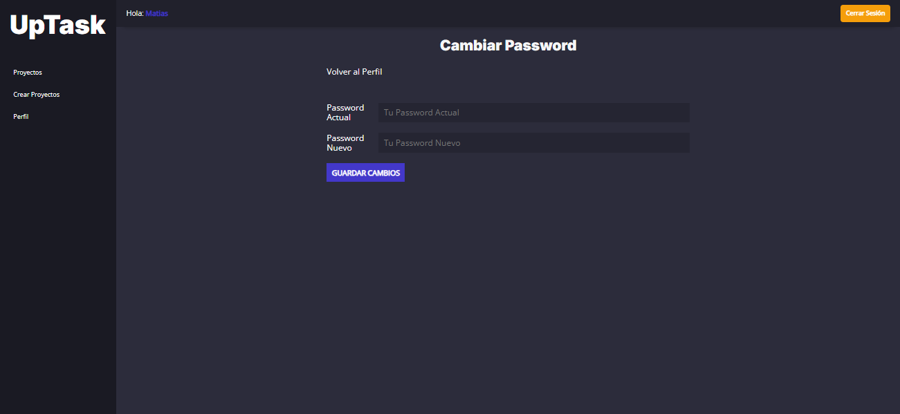
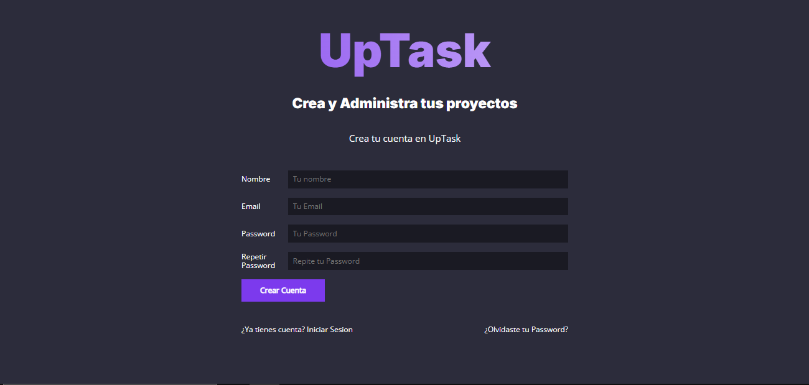
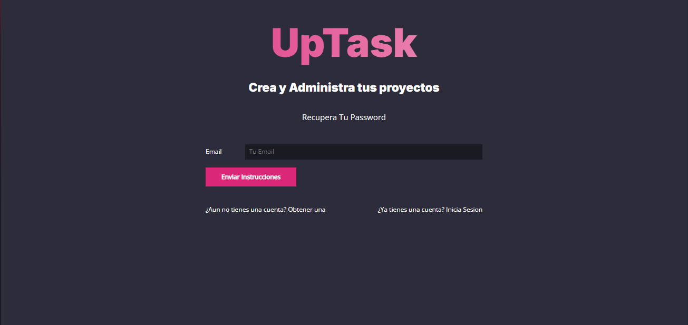
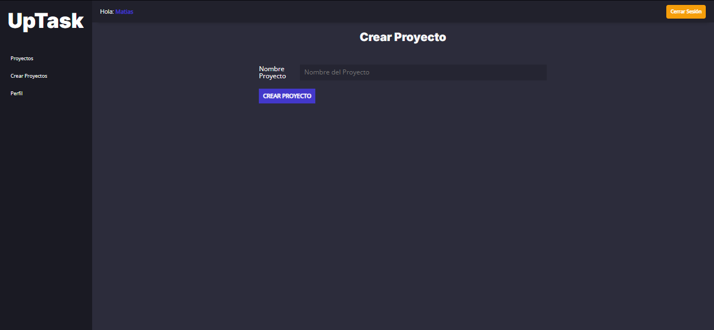
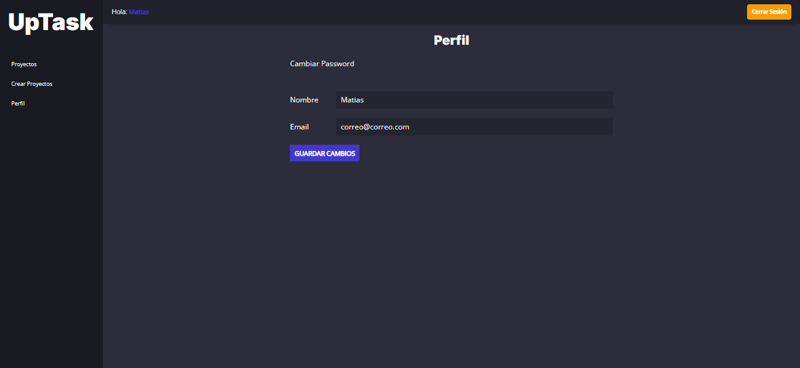
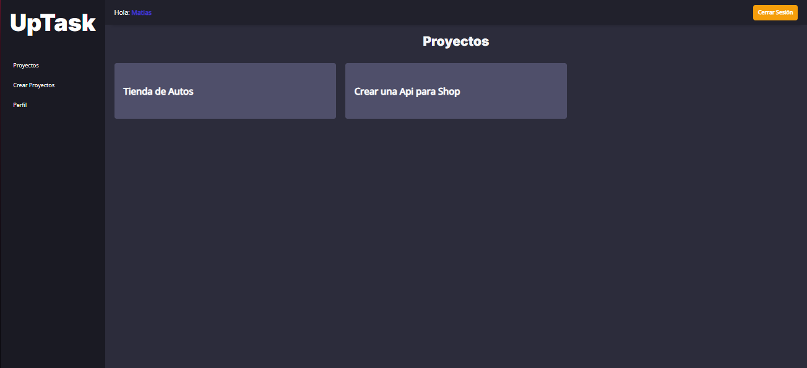
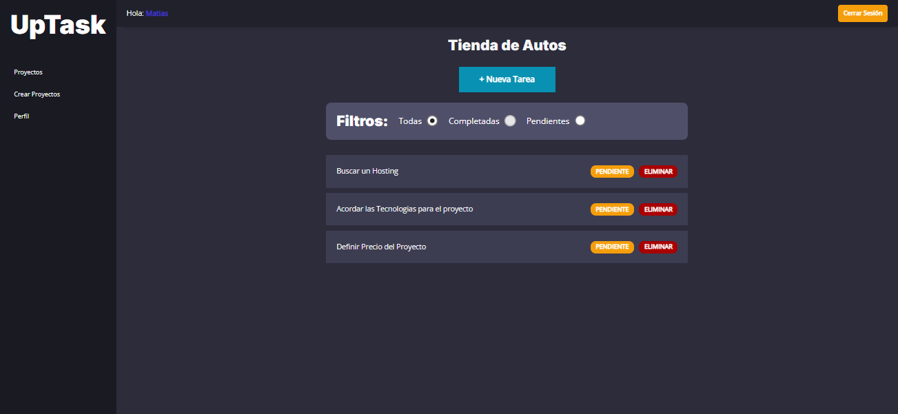
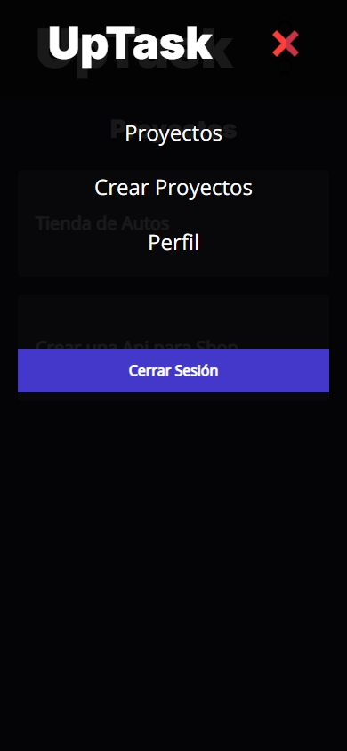
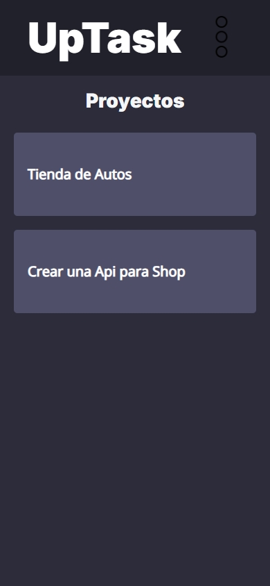
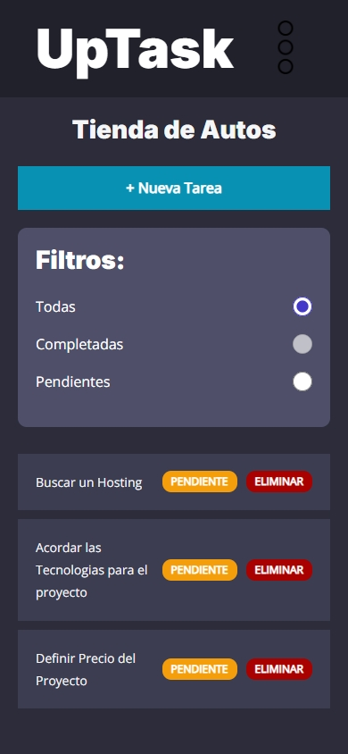

# UpTask MVC

UpTask MVC es una aplicación web desarrollada en **PHP con Arquitectura MVC**, que permite gestionar proyectos y tareas de manera organizada, moderna y eficiente.  
Incluye autenticación completa, sistema de proyectos, tareas dinámicas mediante API interna, modo oscuro, perfiles de usuario y mucho más.

---

## 🚀 Tecnologías utilizadas

- **PHP 8+**  
- **MySQL / MariaDB**  
- **JavaScript (Fetch API, DOM)**  
- **HTML5 & SCSS**  
- **Composer (Autoload y dependencias)**  
- **Node / NPM / Gulp (compilación de assets)**  
- **PHPMailer (confirmación de cuenta y recuperación de contraseña)**  
- **Apache / Nginx con URL Rewriting**  

---

## 📌 Funcionalidades principales

### 🔐 Autenticación y cuentas de usuario
- Registro de usuario
- Login y Logout seguro
- Confirmación de cuenta por correo
- Recuperación y restablecimiento de contraseña
- Protección de rutas para usuarios autenticados

### 📁 Gestión de proyectos
- Crear nuevos proyectos
- Editar títulos y datos
- Eliminar proyectos
- Dashboard con listado de proyectos del usuario

### 📝 Gestión de tareas
- Crear nuevas tareas dentro de cada proyecto
- Cambiar estado (pendiente / completada)
- Eliminar tareas
- Actualización del DOM sin recargar gracias a API interna
- Validaciones y respuestas JSON

### 👤 Perfil de usuario
- Editar datos personales
- Validación de email único
- Visualización de alertas de éxito o error

### 🌙 Modo oscuro (Dark Mode)
- Activar / desactivar con un toggle
- Persistencia de preferencia en localStorage
- Interfaz optimizada para ambos temas

---

🖼 Capturas de pantalla

Login


Cambiar Password


Crear Cuenta


Recuperar Password


Crear Proyecto


Editar Perfil


Proyectos


Tareas


Menu Mobile


Proyecto Mobile


Tareas Mobile


---

## 📥 Instalación y configuración

### 1️⃣ Clonar el repositorio
```bash
git clone https://github.com/Maty1337/uptask_mvc.git
cd uptask_mvc
git checkout develop
```

### 2️⃣ Instalar dependencias PHP
```bash
composer install
```

### 3️⃣ Configurar archivo .env
```bash
cp .env.example .env
```

Editar los valores:
```
DB_HOST=localhost
DB_USER=root
DB_PASS=
DB_NAME=uptask

APP_URL=http://localhost
SMTP_HOST=smtp.mailtrap.io
SMTP_USER=xxxxxx
SMTP_PASS=xxxxxx
```

### 4️⃣ Crear la base de datos
Importar el archivo SQL correspondiente a las tablas:

- usuarios
- proyectos
- tareas
- tokens

(Usar utf8mb4)

### 5️⃣ Compilar los assets (CSS/JS)
```bash
npm install
npm run build
```

Los archivos compilados quedan en:
```
/public/build/
```

### 6️⃣ Configurar el servidor
Asegurar que el DocumentRoot apunte a:
```
/public
```

Agregar `.htaccess`:
```apache
RewriteEngine On
RewriteCond %{REQUEST_FILENAME} !-d
RewriteCond %{REQUEST_FILENAME} !-f
RewriteRule ^ index.php [QSA,L]
```

### 7️⃣ Ejecutar en local (PHP server)
```bash
php -S localhost:8000 -t public
```

---

## 📁 Estructura del proyecto

```
uptask_mvc/
│
├── public/              # Document Root
│   ├── index.php
│   └── build/           # CSS / JS / imágenes compiladas
│
├── controllers/         # Controladores MVC
├── models/              # Modelos + ActiveRecord
├── views/               # Vistas (auth, dashboard, tareas, proyectos, perfil)
├── classes/             # Email y utilidades
├── src/scss/            # SCSS fuente
├── router.php           # Rutas de la aplicación
├── composer.json        # Autoload PHP
└── .env.example         # Variables de entorno
```

---

## 👨‍💻 Autor

**Matías Buenaventura – Maty1337**  
GitHub: https://github.com/Maty1337


## ⭐ ¡Apoya el proyecto!
Si este proyecto te fue útil, considera dejar una estrella ⭐ en el repositorio.  
¡Es gratis y ayuda mucho! 🚀
